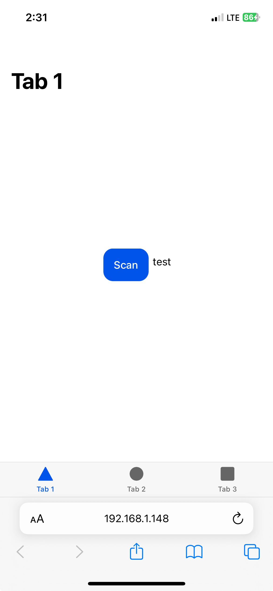

# POC: CapacitorBarcodeScanner

A simple ionic/angular app implementing https://github.com/ionic-team/capacitor-barcode-scanner.

This app contains a single "Scan" button that should open the scanner.

## Installation

### Package installs

`yarn install` to install packages.

## Generating a SSL cert

In the root of your project, run:

`openssl req -x509 -nodes -newkey rsa:2048 -keyout key.pem -out cert.pem -days 365`

This will generate two files: key.pm and cert.pem. _ionic.config.json_ has already been updated to point to these two files.

### Running Externally

To expose the port number for your Ionic Angular app, you need to first ensure that your device and development machine are connected to the same network.

Start by running your Ionic Angular app using the following command in your project directory:

`ionic serve --external`

This will start the development server and expose the app to external devices on the network.

After running this command, you will see a message in the terminal showing the external address and port number where your app is being served. Something like:

```
Local: http://localhost:8100
External: http://192.168.1.100:8100
```

Make a note of the external address (in this case, http://192.168.1.100:8100) as this is the IP address you will use to access the app on your phone.

Open a web browser (Safari) on your phone and enter the external address followed by the port number (e.g. http://192.168.1.100:8100). Press enter and you should see your Ionic Angular app running on your phone.

If you encounter any issues accessing the app on your phone, ensure that your firewall settings allow incoming connections on the specified port number and that your phone is connected to the same network as your development machine.

If you’re still getting a security warning, install cert.pem on your device. A quick way is to airdrop the file and install. Otherwise, the HTML5 video will not work.



### Loading Dev Tools

#### Device

Plug your device directly into your computer. Using a dongle or other adaptors will not work.

Navigate to the page in Safari using the steps above.

The app should load!

#### Computer

Open Safari on your computer.

Under the Develop menu, select your device & the port number. This will open dev tools so you can see console logs, etc.
